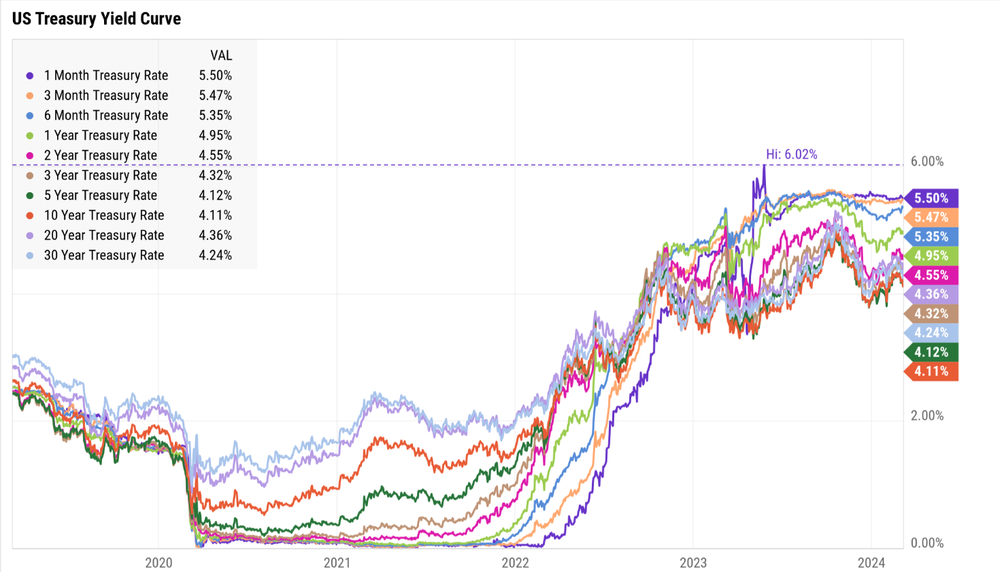

# Treasury Yield Curve Dynamics and Forecasting (2019–2025)

## Project Introduction

This project analyzes U.S. Treasury yield curve evolution and drivers from 2019 through October 2025 to detect both parallel and non-parallel movements and produce short- to medium-term forecasts for improved hedging and risk management.

## Table of Contents

- [References to Analysis](#references-to-analysis)  
- [Problem Statement](#problem-statement)  
- [Solution Overview](#solution-overview)  
- [Project Structure & Methodology](#project-structure--methodology)  
- [Dataset Description](#dataset-description)  
- [Credits & References](#credits--references)

## References to Analysis

Analysis and experiments are documented in the notebooks below:  
1. [notebooks/01_data_ingest_and_preproc.ipynb](notebooks/notebook1_data_import_EDA.ipynb)  
2. [notebooks/02_eda_yield_curve.ipynb](notebooks/notebook2_factor_analysis.ipynb)  
3. [notebooks/03_regime_decomposition.ipynb](notebooks/notebook3_time_series_analysis.ipynb)  
4. [notebooks/04_pca_lsc_and_dns.ipynb](notebooks/notebook4_dynamic_nelson_seigel_mode.ipynb)  
5. [notebooks/05_forecasting_ar_var.ipynb](notebooks/notebook5_macro_market_data_preparation.ipynb)  
6. [notebooks/06_ml_models_and_evaluation.ipynb](notebooks/notebook6_integrating_macro_data_and_ML_models.ipynb)

## Problem Statement
As a former trader, I worked with investment teams on hedging and risk monitoring in fixed income, where common practice assumes primarily parallel yield-curve shifts. In reality, yield curves show significant non-parallel movements—slope changes, curvature shifts and occasional inversions—that complicate duration and convexity hedging. Managing both duration and convexity simultaneously raises costs and operational complexity due to constraints like minimum trading units, no short selling, and the need for dynamic rebalancing.  

Accurately detecting regime changes in real time and forecasting future yield-curve trajectories is therefore essential to enable more proactive, cost-effective hedging, better risk monitoring, and improved portfolio performance under complex market dynamics.

## Solution Overview
 
- **Goals:** Characterize and decompose non-parallel movements, detect regime shifts, and produce short- to medium-term yield-curve forecasts to inform hedging and risk decisions.  
- **Methods:** EDA in understanding treasury yield curve changes, Level–Slope–Curvature (LSC) FrameworkLSC with PCA, time-series forecasting, Dynamic Nelson–Siegel (DNS) modeling, and machine-learning models to predict future yield changes.
- **Data:** Daily US Treasury yields across maturities (1M, 3M, 6M, 1Y, 2Y, 5Y, 10Y, 20Y, 30Y) from FRED, plus macro variables (CPI, PPI, PCE, GDP, unemployment, S&P 500, VIX, USD Index) from FRED, BLS, BEA, and Yahoo Finance (yfinance). 

## Practical Applications

The PCA-derived LSC factors simplify complex yield data into actionable signals for traders and risk managers. They can be used to monitor market regimes, construct targeted hedges, generate relative-value trades, and improve forecasting accuracy—all with a clear, interpretable structure that supports proactive risk management and trading decisions.

**Additional notes:**  
- Regularly update and validate factors.  
- Conduct cost analysis before hedging.

## Project Structure & Methodology

Repository layout:
- `data/` — raw and processed CSVs (U.S treasury yields, macro and market data).  
- `notebooks/` — EDA, factor analysis, time series analysis, dynamic NS model, macro data extraction, ML models (linked above).  
- `docs/` - supporting files .  
- `README.md` — this file.
---

Methodology (stepwise):

 Notebook 1 — Data ingestion & EDA
 1. **Data ingestion:** fetch daily Treasury yields and macro series, align calendars, handle missing dates, and compute yield changes.
 2. **Exploratory data analysis (EDA):** visualize yield curves over time; plot Level, Slope, and Curvature series; generate correlation heatmaps and volatility diagnostics.

 Notebook 2 — Factor decomposition & applications
 3. **Factor decomposition:** run PCA on yield changes (excluding 1-month to reduce short-term noise), map first three PCs to Level, Slope, and Curvature, and validate with DNS factors.
 4. **Practical applications:** leverage PCA results for trading, portfolio management, and risk strategies—monitoring, targeted hedging, relative-value signals, risk attribution, and stress testing.

 Notebook 3 — Time series forecasting & regime detection
 5. **Time-series forecasting:** fit AR/VAR models on yield and factor series to generate 1–6 month ahead forecasts; use rolling validation.

 Notebook 4 — Dynamic Nelson–Siegel (DNS)
 6. **DNS modeling:** fit the DNS model to the yield curve, forecast the DNS factors, reconstruct forecasted curves, and evaluate model performance.

 Notebook 5 — Advanced features, regime-aware ML
 7. **Advanced feature engineering:** develop features capturing momentum, medium-term trends, market volatility, and curve structure reflecting recent dynamics.
 8. **Regime decomposition:** identify market regimes through change-point detection or clustering based on yield changes and macro indicators; use regimes to improve model robustness.
 9. **Regime-aware machine learning:** train separate ML models for each regime, evaluate their performance, and compare against baseline statistical models.

## Dataset Description

**Core dataset:**
- **Source:** U.S. Treasury yields — FRED (https://fred.stlouisfed.org).  
- **Maturities:** 1M, 3M, 6M, 1Y, 2Y, 5Y, 10Y, 20Y, 30Y.  
- **Frequency & period:** daily observations, Jan 1, 2019 — Oct 22nd, 2025.

**Additional series:**
- Inflation: CPI, PPI, PCE (BLS, FRED).  
- Macros: GDP (BEA), unemployment rate (BLS).  
- Market indicators: S&P 500, VIX, USD Index (yfinance / FRED).
\

## Credits & References

- Federal Reserve Economic Data (FRED): https://fred.stlouisfed.org  
- Bureau of Labor Statistics (BLS): https://www.bls.gov  
- Bureau of Economic Analysis (BEA): https://www.bea.gov  
- Diebold, F.X. & Li, C. (2006). Forecasting the term structure of government bond yields. Journal of Econometrics.  
- Nelson, C. R., & Siegel, A. F. (1987). Parsimonious Modeling of Yield Curves.  
- Useful packages: `statsmodels` (AR/VAR), `scikit-learn` (PCA), `pydynps` (or equivalent DNS), `yfinance`

---